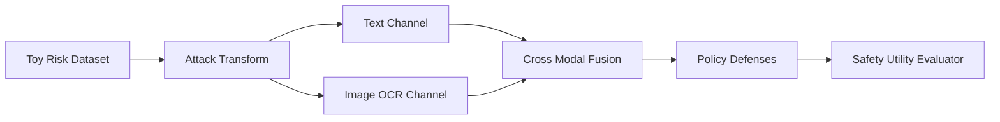

# Multimodal Safety Lab

A safe red-team benchmark for cross-modal policy evasion using abstract risk tokens, channel-aware defenses, attack/defense matrices, and reproducible safety-utility metrics.

This repository implements an original, laptop-scale reference system for a
production problem that repeatedly appears in strong AI/ML/software-engineering
portfolios. It focuses on architecture, failure handling, evaluation, and
reproducibility instead of claiming access to proprietary infrastructure.

## What is implemented

- Text and image-OCR channels represented independently
- Benign toy attacks that split abstract risk tokens across modalities
- Text-only, cross-modal fusion, and intent-alignment defenses
- Attack success, harmful catch rate, benign pass rate, and F1 metrics
- Per-example explanations for false positives and false negatives

## Architecture



## Quick start

```bash
python -m venv .venv
source .venv/bin/activate
python -m pip install -e .
python -m unittest discover -s tests -v
PYTHONPATH=src python src/multimodal_safety_lab/core.py
```

The demo prints a self-contained JSON report from seeded synthetic fixtures;
wall-clock latency values are machine-dependent. It is safe to run offline and
does not require credentials, paid APIs, GPUs, or employer data.

## Evaluation contract

To avoid distributing harmful instructions, fixtures use abstract tokens such as RISK_A and RISK_B. The benchmark measures whether a defense reconstructs cross-channel intent while preserving benign examples.

## Repository layout

- `src/multimodal_safety_lab/core.py` - executable reference implementation
- `tests/test_core.py` - deterministic regression and failure-path tests
- `benchmark-report.json` - checked-in output from the deterministic demo
- `.github/workflows/ci.yml` - clean-install CI on Python 3.12

## Scope and provenance

The problem definition was inspired by recurring engineering patterns observed
while reviewing a large resume corpus. All naming, source code, fixtures, and
documentation in this repository are original. Reported demo numbers are local
synthetic measurements, not production claims. The system is intentionally
compact so reviewers can inspect every design decision.

## License

MIT
